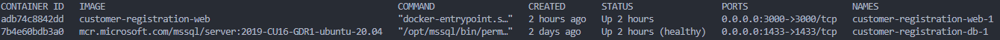

# Customer API

Uma API para armazenar os dados do [front-end]() em angular.

## 🚀 Começando

Essas instruções permitirão que você obtenha uma cópia do projeto em operação na sua máquina local para fins de consulta, desenvolvimento e teste.

### 📋 Pré-requisitos

- **[Node v16.17.0](https://nodejs.org/en/)**
- **[Docker](https://docs.docker.com/engine/install/)**

Para verificar se o node foi instalado corretamente:

```
node -v
```

Para verificar se o node foi instalado corretamente:

```
docker -v
```

### 🔧 Instalação

[ENV](https://drive.google.com/file/d/1k4PwpQCHFFdAaJTK7QZdLF73DBBBVS72/view?usp=sharing)

Acima segue o .env modelo para a aplicação, coloque na raíz do projeto.

Para subir e executar os containers da aplicação, abra um terminal na raiz projeto e digite:

```
docker-compose up -d --build
```

Aguarde todos os containers serem executados.

Para verificar o status de cada container, digite no terminal:

```
docker container ls
```



O projeto será iniciado na porta 3000 por padrão.

## 🛠️ Construído com

- [Express](https://expressjs.com/pt-br/) - O framework web usado
- [Sequelize](https://sequelize.org/) - ORM de bancos relacionais.
- [SQL Server Image](https://hub.docker.com/_/microsoft-mssql-server) - Imagem do SQL server utilizada.
- [JSON Web Token](https://jwt.io/introduction) - Como autenticador.

## ⚙️ Consultando os endpoints

Você pode baixar a collection da aplicação [aqui](https://www.getpostman.com/collections/e50e188a511569c4503e). Você precisa criar um login, copiar seu token e colocar em Variables, dessa forma pode acessar qualquer end-point.

End-point:

```
Post: localhost:3000/login
```

Body da requisição:

```
{
  "email": "email@email.com",
  "password": "123456",
  "name": "test"
}
```

> Irá devolver seu usuário e token.

A aplicação consiste em quatro operações básicas na bases de dados, um [CRUD](https://coodesh.com/blog/dicionario/o-que-e-crud/).

### Create

```
POST: localhost:3000/costumer
```

No body da requisição em raw este é o modelo em JSON para ser enviado:

```
{
  "name": "Helena Souza Prado",
  "email": "helena@email.com",
  "cpf": "123456999",
  "phone": 123456789,
  "address": "Rua b, 123",
  "cep": "123456"
}
```

### Read

```
GET: localhost:3000/customer
```

Você também pode consultar uma universidade específica.

```
GET: localhost:3000/customer/:id
```

### Update

```
UPDATE: localhost:3000/customer/:id
```

No body da requisição em raw este é o modelo em JSON para ser enviado:

```
{
  "name": "Maria Gonçalves Prado",
  "email": "maria@email.com",
  "cpf": "123456799",
  "phone": 123456789,
  "address": "Rua b, 122",
  "cep": "123476"
}
```

### Delete

```
DELETE: localhost:3000/customer/:id
```

## 📦 Implantação

Você pode popular o banco com dados já modelados para aplicação, bastar rodar:

```
npx sequelize-cli@6.4.1 db:seed:all
```

Alguma dúvida? Entre em contato comigo: iohara.pereira@hotmail.com

⌨️ com ❤️ por [Iohara](https://github.com/Iohara1997) 😊
